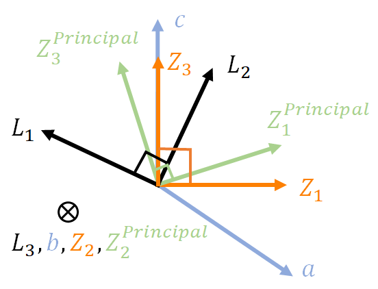

# Simulation and Analytical Methods
## Optical Geometry

**Fig. 1(a-c)** and **(d-f)** are the two common schematics of experimental geometries where the red and blue rays are the fundamental and second harmonic light, respectively. The plane of incidence is defined as the $L_1 - L_3$ plane, where $(L_1,L_2,L_3)$ are the lab coordinates as displayed in **Fig. 1a** and **d**.

While rotating the incident polarization ($E$$^i$($\phi$)), polarized SH intensities are collected as a function of the azimuthal angle . **Fig. 1b** depicts the collection of _p_ and _s_ polarized SH intensities ($I_p^{2\omega} (\psi)$ and $I_s^{2\omega} (\psi)$) and **Fig. 1e** illustrate the SH intensities polarized both parallel and perpendicular to the incident fundamental polarization ($I$$_\parallel$$^2$$^\omega$ ($\phi$) and $I$$_\perp$$^2$$^\omega$ ($\phi$)) if projected in $s - p$ plane. Here,  _s_ and _p_ describes the electrical fields of electromagnetic waves within and perpendicular to the plane of incidence ($L_1 - L_3$ plane), respectively.

The former geometry is commonly achieved with a rotating halfwave plate and fixed analyzer while the latter geometry can be achieved by simply rotating the crystal or rotating the halfwave plate and analyzer simultaneously. **Fig. 1c** and **f** demonstrate the SHG polar plots of GaAs (111) obtained at normal incident geometry which contain information of crystal symmetry, refractive indices at both  and  frequencies, and second-order nonlinear susceptibility.

>Figure 1. Two common types of experimental geometries for SHG polarimetry. **a-c** _p_- and _s_- polarized SHG intensities as a function of incident fundamental polarization. **d-f** SHG intensities polarized both parallel and perpendicular to the incident polarization projected in $s - p$ plane. Red and blue waves suggest a pump beam at $\omega$ and signal beam at $2\omega$ frequency, separately. $(L_1,L_2,L_3)$ is the lab coordinate system. The orange and dark grey planes are the sample surface and plane of incidence ($L_1 - L_3$ plane).  $\psi$ is the azimuthal angle. **b,e** Relations of incident polarization and SHG polarization projected in $s - p$ plane. **c,f** SHG polar plots of GaAs (111) in the normal incident geometries using two experimental configurations described in panels **a**,**b**, and **d**,**e**, separately.

## Coordinate System

Four different coordinate systems shown in **Fig. 2** are involved in fully describing the SHG measurement, and it is essential to establish their absolute and relative orientations.

On the lab scale, $(L_1,L_2,L_3)$ describe the _lab coordinate system_ (LCS) and $L_3$ corresponds to the normal to the surface; this coordinate system is always orthogonal. 

Looking at the atomic scale, the translation vectors of a unit cell of the crystal determine the _crystallographic coordinate system_(CCS) given by (_a_, _b_, _c_); these axes need _not_ be orthogonal.

The $(Z_1,Z_2,Z_3)$ represent the _crystal_ _physics coordinate system_ (ZCS) in which the material property tensors are represented; they are always orthogonal and their orientation relative to (_a_, _b_, _c_) follows Newnham’s convention.

The $(Z_1^{Principal},Z_2^{Principal},Z_3^{Principal})$ is the _principal coordinate system_ (PCS), where dielectric tensors or refractive index tensors are diagonalized; this coordinate system is also always orthogonal. For an isotropic or uniaxial structure, $(Z_1,Z_2,Z_3)\equiv (Z_1^{Principal},Z_2^{Principal},Z_3^{Principal})$ , which simplifies the overall problem. However, for a biaxial crystal, the PCS is _defined_ with the real part of the refractive indices along each axis following the ascending order, i.e.,$n(Z_1^{Principal})<n(Z_2^{Principal})<n(Z_3^{Principal})$ , while this is _not_ generally true in the crystal physics coordinate system. Henceforth, we will adopt the notation $n(Z_1^{Principal}) \equiv n_i^{\omega}$  for the Eigen values for the refractive index. In the PCS, the diagonal components of the complex _relative_ dielectric function can be conveniently written as $\epsilon^{Principal} \equiv \epsilon_i^{\omega}$ , where  is the vacuum permittivity. Therefore, the dielectric permittivity $\epsilon_i^{\omega}$ in the LCS can be expressed as
$$
\epsilon_i^{\omega} = a_{LZ}a_{ZP}\begin{pmatrix} n_1^{\omega}&0&0 \\\ 0&n_2^{\omega}&0 \\\ 0&0&n_3^{\omega}\end{pmatrix}^2(a_{LZ}a_{ZP})^{-1}
$$where  is the rotation matrix from ZCS to the LCS and  is the rotation matrix from the PCS to the ZCS, respectively.

## Calculation at $\omega$ Frequency
## Calculation at $2\omega$ Frequency