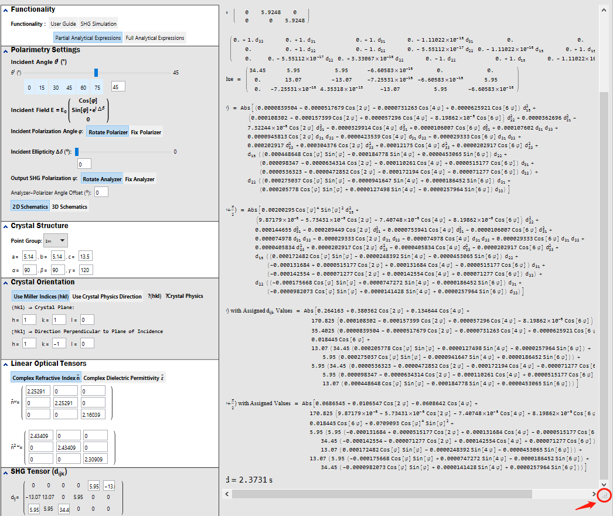
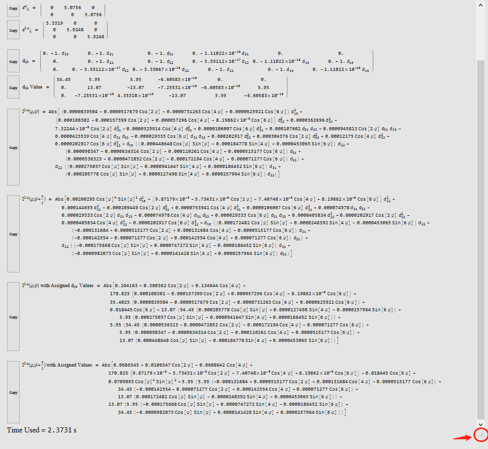

## initialization of SHAARP 
- Q: Main Panel does not show up 
- A: It usually takes 20 ~ 30s for the initialization depending on the configuration of hardware. 

## Warning message of SHAARP 
- Q: Why there are warning signs before progress bar 
- A: This is because the environment is not properly initialized. Go to Evaluation → Evaluate Notebooke. The warning sign should disappear.

## Output does not display properly in partial/full analytical expressions 
- Q: The output is cropped, and I can not see the full output
- A: This is because Mathematica will adjust the display of the output depending on the length of the expressions. Drag the small triangle button at the bottom right of the output page to adjust the view panel to see the full output.
>
>The initial cropped display.

>
>Display after adjusting the output size using the bottom right triangle 
## Initialization of SHAAP 
- Q: Cannot initialize `SHAARP_Init.nb` 
- A: Make sure the initialization notebook `SHAARP_Init.nb` is inside the same folder of `SHAARP_SI_Vxx.nb`. 
	- Otherwise, try to explicitly give the absolute path of `SHAARP_Init.nb`, just like 
