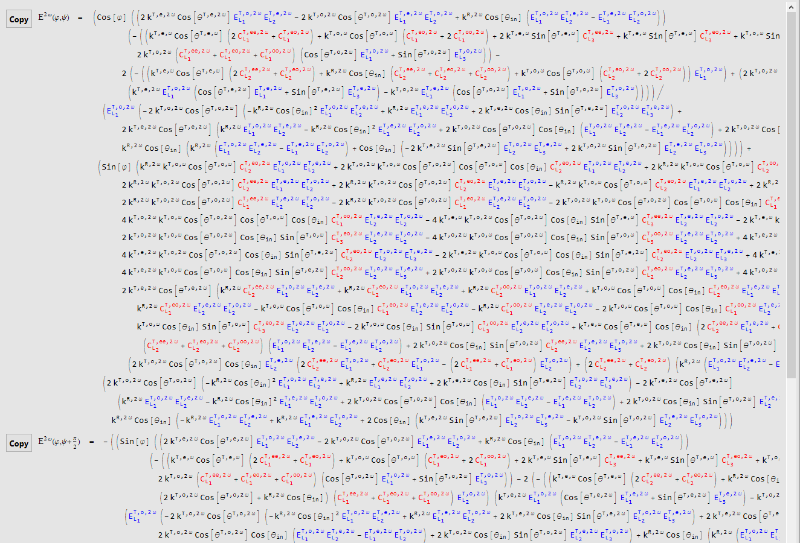

# Examples

## GaAs(111) at 800 nm
### SHG Simulation
GaAs crystallizes in a cubic structure with the point group $\overline{4}3m$ and its linear and nonlinear optical properties have been extensively studied. In this example, the polarized nonlinear optical response will be simulated and derived both numerically and analytically.

- Follow [Open the ♯SHAARP._si_.nb in the _Mathematica®_ software on your computer](install.md#Open the ♯SHAARP._si_.nb in the _Mathematica®_ software on your computer) to initiate the Mathematica notebook.
- Click SHG Simulation in the Functionality section.
- Click next to the Case Studies to expand the content in the section.
- Click  GaAs (111) to update input parameters for Crystal Structure, Crystal Orientation, Linear Optical Tensors and SHG Tensors (d<i>ijk</i>). The lattice parameters can be found in the [CIF file](http://www.crystallography.net/cod/9008845.cif). The complex linear optical properties can be found in [RefractiveIndex.Info](https://refractiveindex.info/?shelf=main&book=GaAs&page=Aspnes) and the nonlinear optical tensors were evaluated by the [Ref](https://doi-org.ezaccess.libraries.psu.edu/10.1103/PhysRevLett.90.036801). Then click Update to evaluate the new input.
- The output results will be shown in the right-hand panel. The **Probing Geometry** and **Polarization Relations** shows the orientation of crystals and polarization configuration.
>GeometryPolarization45.png)
>Probing Geometry and polarization settings for GaAs (111)

Here, in the **geometry plot**, $(L_1,L_2,L_3)$ depicts the lab coordinate system forming a right-handed coordinate, and the normal of surface (111) plane is parallel to the $L_3$ direction. The $L_1-L_3$ forms the plane of incidence (PoI) as colored in blue. The input [hkl]->Direction Perpendicular to Plane of Incidence is set parallel to the $L_2$ direction. In the **polarization plot**, the both incident polarization at $\omega$ frequency and output SHG polarization at $2\omega$ frequency are rotated simultaneously with a same azimuthal angle $\varphi$. Two output SHG electric fields (colored in blue and red) with orthogonal polarization are collected.

- The intensity of the selected electric fields are plotted as a function of $(\varphi,\Psi)$ and plotted with the same color code as presented in **Polarization Relations**.

>PolarPlot45.png)
>SHG polar plots as a function of $(\varphi,\Psi)$. The directions of output polarization share the same set of color codes as presented in **Polarization Relations** plot.

- The **Effective refractive index** and **Ellipticity** of incident light at $\omega$ are shown in the third row. In the **Effective refractive index** plot, the real parts of effective refractive indices are shown as a function of incident angle. Superscript 1 and 2 refer to ordinary and extraordinary waves. In cubic GaAs case, refractive indices are the same regardless of the directions of electric fields. In the **Ellipticity** plot, the phase relation of $E_p$ and $E_s$ is shown. If linear polarization is rotated, the ellipticity of light will be shown with $\varphi=45^o$, otherwise the explicit direction of $E^{\omega}$ will be shown.
>IndexEllipticity.png)
>**Effective refractive index** shows the effective refractive indices for both ordinary and extraordinary waves as a function of incident angle at $\omega$ freqency. **Ellipticity** exhibits phase relations between $E_p$ and $E_s$ at $\omega$ freqency.

### SHG Partial Analytical Expressions
- Follow [Open the ♯SHAARP._si_.nb in the _Mathematica®_ software on your computer](install.md#Open the ♯SHAARP._si_.nb in the _Mathematica®_ software on your computer) to initiate the Mathematica notebook.
- Click SHG Partial Analytical Expressions in the Functionality section.
- Click next to the Case Studies to expand the content in the section.
- Click  GaAs (111) to update input parameters for Crystal Structure, Crystal Orientation, Linear Optical Tensors and SHG Tensors (d<i>ijk</i>). The lattice parameters can be found in the [CIF file](http://www.crystallography.net/cod/9008845.cif). The complex linear optical properties can be found in [RefractiveIndex.Info](https://refractiveindex.info/?shelf=main&book=GaAs&page=Aspnes) and the nonlinear optical tensors were evaluated by the [Ref](https://doi-org.ezaccess.libraries.psu.edu/10.1103/PhysRevLett.90.036801). Then click Update to evaluate the new input.
- The output results will be shown in the right-hand panel as presented below.
- The partial analytical expressions are expressed with **SHG coefficients variables** and **numerical values for the rest of the parameters**.
- The **Copy** button next to the equation allow direct copy of the equation to the clipboard.
>
>

### SHG FullAnalytical Expressions
- Follow [Open the ♯SHAARP._si_.nb in the _Mathematica®_ software on your computer](install.md#Open the ♯SHAARP._si_.nb in the _Mathematica®_ software on your computer) to initiate the Mathematica notebook.
- Click SHG Full Analytical Expressions in the Functionality section.
- Click next to the Case Studies to expand the content in the section.
- Click  GaAs (111) to update input parameters for Crystal Structure, Crystal Orientation, Linear Optical Tensors and SHG Tensors (d<i>ijk</i>). The lattice parameters can be found in the [CIF file](http://www.crystallography.net/cod/9008845.cif). The complex linear optical properties can be found in [RefractiveIndex.Info](https://refractiveindex.info/?shelf=main&book=GaAs&page=Aspnes) and the nonlinear optical tensors were evaluated by the [Ref](https://doi-org.ezaccess.libraries.psu.edu/10.1103/PhysRevLett.90.036801). Then click Update to evaluate the new input.
- The output result will be shown in the right-hand panel as presented below (this process can take a few minutes, please be patient). You can refer to the progress bar at the top of the panel for current status.
>
>Full Analytical Expressions. Types of variables are color-coded with distinct colors. 

- The full analytical expressions are expressed with pure variables. The definition of variables can be accessed using the [variable table](table.md).
- The **Copy** button next to the equation allow direct copy of the equation to the clipboard.

## LiNbO<b>3</b>(110) at 800 nm
Please refer to the [demo](install.md#Try&nbsppreset&nbspdemos) in [getting started](install.md) section for LiNbO3 case.