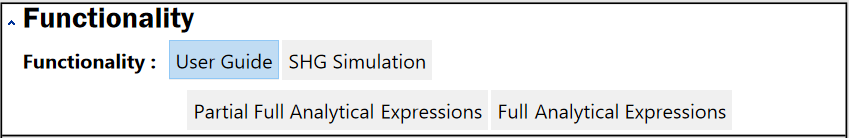
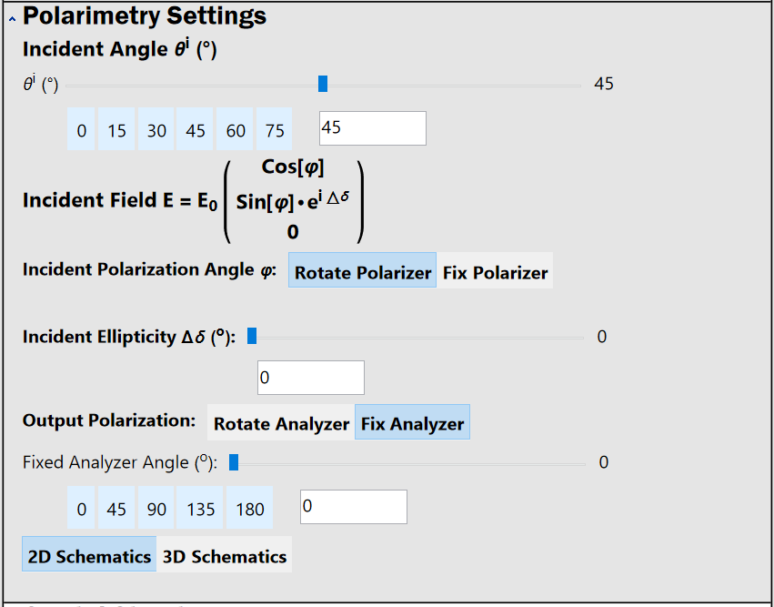
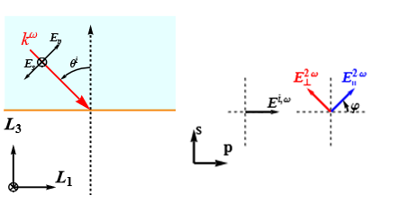
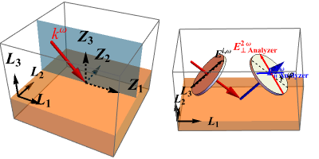
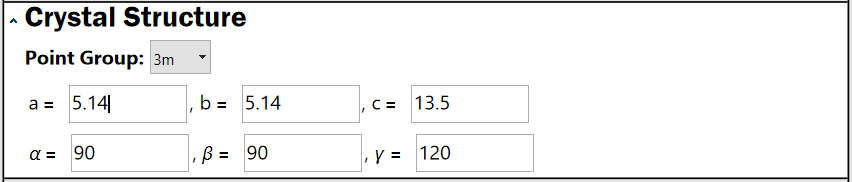

# Input Parameters
This section introduces each subpanel of the input panel. Each subpanel is folderable and can be expanded of collapsed bysingle- clicking the $\wedge$ or $\vee$ at the upper left corner. 
## Functionality
>
>**Functionality subpanel**

This subpanel contains four tabs corresponding to three different modes 
- User Guide shows the Welcome Page and a quick start example of SHAARP. 
- SHG Simulation directs to the tab for numerical simulation of SHG polarometry. 
- Partial Analytical Expression directs to the tab for deriving the analytical expression of reflective SHG intensity with _some_ input parameters to be unknown and symbolic and others known with numerical values. 
- Full Analytical Expression directions to the tab for showing the full analytical expression of reflective SHG intensity with _all_ input parameters to be unknown. 
## Polarimetry Settings
>
>**Polarimetry subpanel**

This subpanel input parameters related to the geometric setup for the virtual polarimetry experiment. 
- Incident Angle specifies the incidenent angle of the incident wave with respect to the out-of-plane of the single surface. 
	- The unit is in `Degree`
	- A few "common" incident angles are provided (0, 15, ..., 75) which can be evaluated by clicking. 
- Incident Field desribes the electric field vector of the incident wave which can be specified by the following parameters. 
	- Incident Polarization Angle $\varphi$  
		- The unit is in `Degree`
		- Two modes of setting up for $\varphi$  
			- Rotate Polarizer
			- Fix Polarizer
				- If this mode is chose, there will be a pop-up setup for the fixed Polarization Angle 
			- Which mode to use can be determined [[Polarizer Mode]] 
	- Incidenet Elllipticity $\Delta \delta$ 
		- The unit is in `Degree`
	- Output Polarization 
		- Two modes of setting up for $\varphi$  
			- Rotate Polarizer
				- If this mode is chose, there will be a pop-up setup for Analyzer-Polarizer Angle Offset (unit in degree)
			- Fix Polarizer
				- If this mode is chose, there is a pop-up setup for the fixed Analyzer Angle 
		- Which mode to use can be determined [[Analyzer Mode]] 
- Schematics 
	- One can choose showing either 2D Schematics or 3D Schematics for the geometric setup and the visual definitions of the angles. 
>
>
>**2D schematics of Polarimetry setup**
>
>
>
>**3D schematics of Polarimetry setup** 

## Crystal Structure
>
>**Crystal Structure subpanel** 

This subpanel specifies the crystallography of the material of interest. 
- Point Group is a drop-down menu specifying the point group of the material of interest. 
- The rest input parameters specify the six lattice constants of the crystal. 

## Crystal Orientation
>![[img/input-crystal-orientation.png]]
>**Setup crystal orientation using crystal physics directions** 
>![[img/input-crystal-orientation-2.png]]
>**Setup crystal orientation using crystal physics directions**

This subpanel specifies the crystal orientation of the material of interest in the geometry of SHG experiments.
There are two modes to setup the orientation: 
- Use Miller Indices (hkl) 
- Use Crystal Physics Direction 

## Dielectric Tensors
>![[img/input-dielectric-tensor.png]]
>**Dielectric Tensor subpanel** 

This subpanel specifies the dielectric permittivity in matrix form for the fundamental $\omega$ and SHG $2\omega$ waves. 
- Note that each entry can be input with a complex number so both the real and imaginary parts of $\varepsilon_{ij}$ can be sepcified.  
## Second Harmonic Generation (SHG) Tensors
>![[img/input-shg-tensor.png]]
>**SHG Tensor subpanel**

This subpanel specifies the SHG tensor (in Voigt notation matrix form)
- Note that constraints due to symmetry (specified via Point Group in the subpanel `Crystal Structure`) are imposed automatically. 
## Case Studies 
>![[img/input-case-studies.png]]
>**Case Studies subpanel** 

This subpanel provides a few case studies for reflective SHG experiments on common nonlinear optical crystals.
- Cases in Manuscript contain the four examples in our manuscript [doi to manuscript](manuscript) 
- Complex SHG Coefficients contain one example with absorption term in the SHG tensor 
- Deep UV NLO contain nonlinear optical crystals in the deep ultraviolet spectrum
- Polar Metals contain crystals with an complex linear dielectric susceptibility
- Other Crystals  

## Material Properties Preset Values
>![[img/input-preset.png]]
>**Material Properties Preset Values** 

This subpanel helps to store a set of user-defined materials properties (including lattice constants, dielectric tensors, and SHG tensors) for up to four different materials. 
- First provide inputs to all the properties for Materials 1, click update to compute and store the results into Preset 1. 
- Then provide inputs to all the properties for Materials 2, click update to compute and store the results into Preset 2. 
- And so on for Materials 3, 4 and Preset 3, 4. 
---
The preset buttons enable you to input a set of material properties, save them to a given preset, and then re-input those properties later with one click. Only material properties, and not polarimetry or experimental geometry settings, are saved. Specifically, the following inputs are saved to each preset:

1. All "Crystal Structure" values (including point group)
2. All "Crystal Orientation" values (including the choice to input miller indices or crystal physics directions)
3. Dielectric tensors and SHG tensors

To use the preset functionality, first input these material properties in the sections from "Crystal Structure" to "SHG Tensor". Then, press the green "Update" button in the top right corner of the manipulate window.

After you do this, pressing any of the preset buttons labeled "Preset 1" through "Preset 4" which you have not previously pressed will save those properties to that preset option. When a preset is saved, the button will appear blue. In addition, a text input field for that preset will appear below the buttons so you can type a label for that set of properties. This label will also be saved so that you don't forget which preset corresponds to each saved material. When you want to use a material's preset information for SHAARP calculations, simply press the button corresponding to the appropriate material. All of the information in the input sections above will be automatically updated. By clicking the green "Update" button, the output plots and equations will be recalculated with the new material properties.

There is a blue button below the preset buttons and labels called "Show Preset Information". If you click this button, it will display which presets are currently set and some brief instructions on how to use the preset functionality. The information about presets that are currently set is not dynamically updated here, but if you click "Hide" and then display this text again, it will update to display the correct presets.

When you want to remove presets, click the "Clear Presets" button. All preset information will be removed, including material properties and labels. Be careful not to do this if you have information saved that you do not want to re-enter.
 