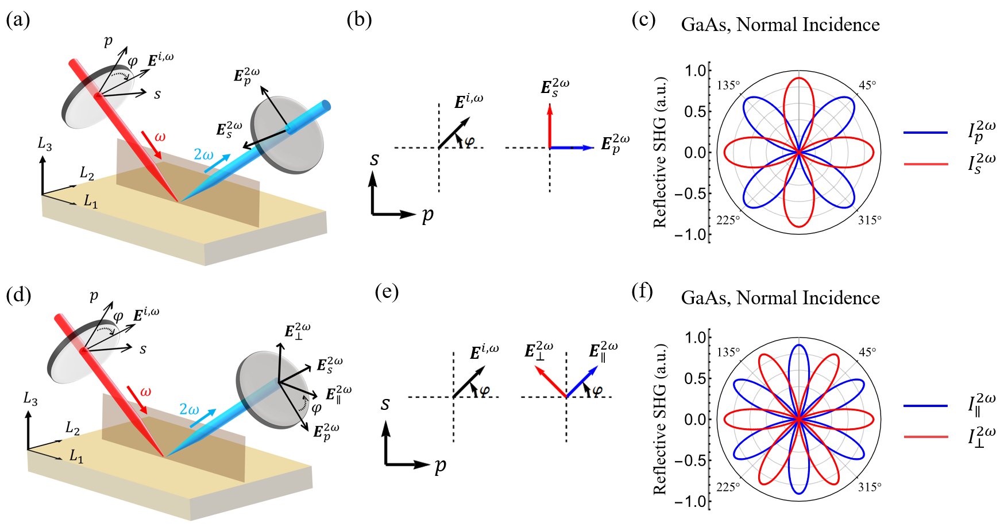
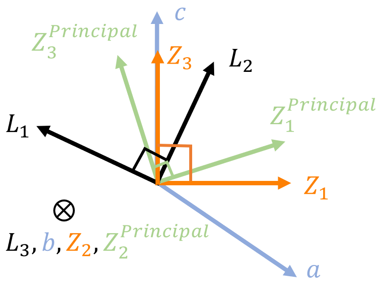
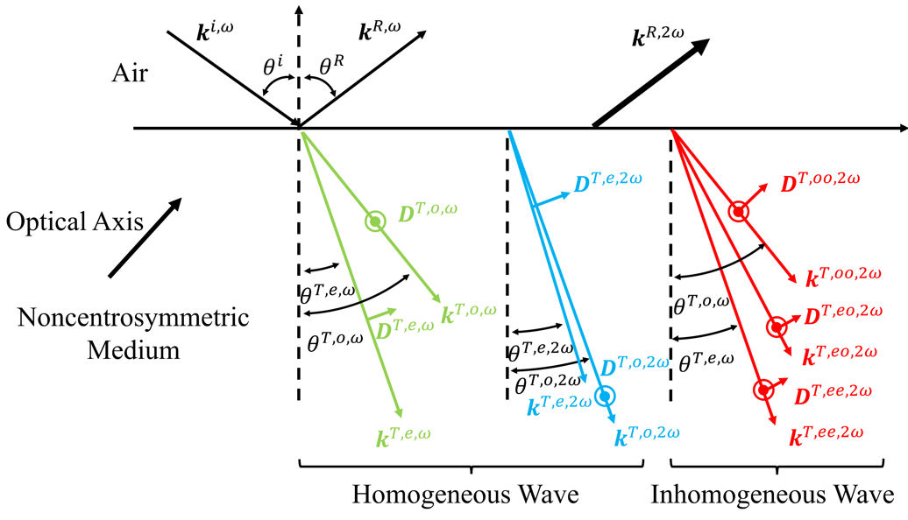
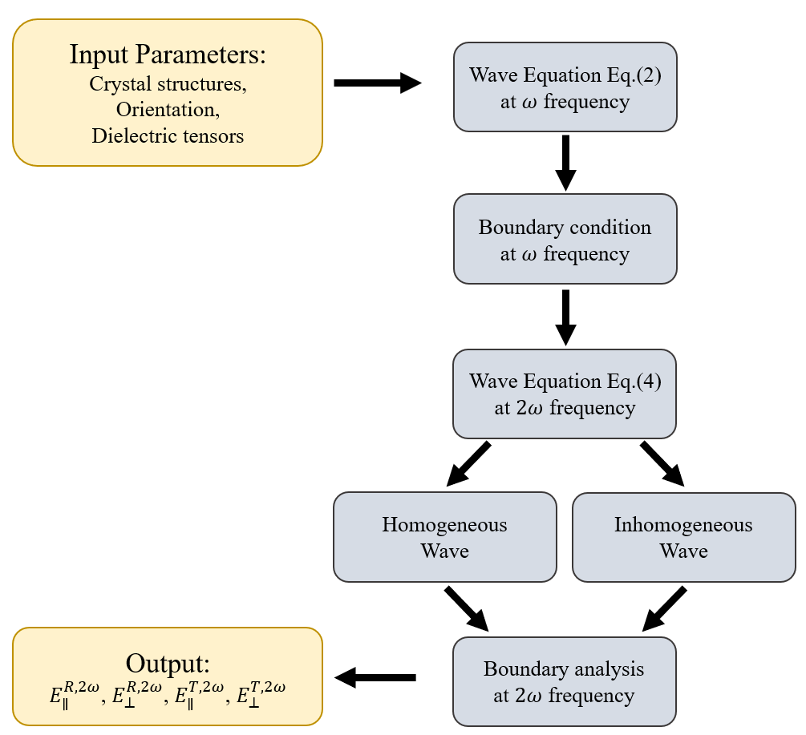

# Simulation and Analytical Methods
## Optical Geometry

**Fig. 1(a-c)** and **(d-f)** are the two common schematics of experimental geometries where the red and blue rays are the fundamental and second harmonic light, respectively. The plane of incidence is defined as the $L_1 - L_3$ plane, where $(L_1,L_2,L_3)$ are the lab coordinates as displayed in **Fig. 1a** and **d**.

While rotating the incident polarization ($E$$^i$($\phi$)), polarized SH intensities are collected as a function of the azimuthal angle . **Fig. 1b** depicts the collection of _p_ and _s_ polarized SH intensities ($I_p^{2\omega} (\psi)$ and $I_s^{2\omega} (\psi)$) and **Fig. 1e** illustrate the SH intensities polarized both parallel and perpendicular to the incident fundamental polarization ($I$$_\parallel$$^2$$^\omega$ ($\phi$) and $I$$_\perp$$^2$$^\omega$ ($\phi$)) if projected in $s - p$ plane. Here,  _s_ and _p_ describes the electrical fields of electromagnetic waves within and perpendicular to the plane of incidence ($L_1 - L_3$ plane), respectively.

The former geometry is commonly achieved with a rotating halfwave plate and fixed analyzer while the latter geometry can be achieved by simply rotating the crystal or rotating the halfwave plate and analyzer simultaneously. **Fig. 1c** and **f** demonstrate the SHG polar plots of GaAs (111) obtained at normal incident geometry which contain information of crystal symmetry, refractive indices at both  and  frequencies, and second-order nonlinear susceptibility.

>
Figure 1. Two common types of experimental geometries for SHG polarimetry. **a-c** _p_- and _s_- polarized SHG intensities as a function of incident fundamental polarization. **d-f** SHG intensities polarized both parallel and perpendicular to the incident polarization projected in $s - p$ plane. Red and blue waves suggest a pump beam at $\omega$ and signal beam at $2\omega$ frequency, separately. $(L_1,L_2,L_3)$ is the lab coordinate system. The orange and dark grey planes are the sample surface and plane of incidence ($L_1 - L_3$ plane).  $\varphi$ is the azimuthal angle. **b,e** Relations of incident polarization and SHG polarization projected in $s - p$ plane. **c,f** SHG polar plots of GaAs (111) in the normal incident geometries using two experimental configurations described in panels **a**,**b**, and **d**,**e**, separately.

## Coordinate System

Four different coordinate systems shown in **Fig. 2** are involved in fully describing the SHG measurement, and it is essential to establish their absolute and relative orientations.

On the lab scale, $(L_1,L_2,L_3)$ describe the _lab coordinate system_ (LCS) and $L_3$ corresponds to the normal to the surface; this coordinate system is always orthogonal. 

Looking at the atomic scale, the translation vectors of a unit cell of the crystal determine the _crystallographic coordinate system_(CCS) given by (_a_, _b_, _c_); these axes need _not_ be orthogonal.

The $(Z_1,Z_2,Z_3)$ represent the _crystal_ _physics coordinate system_ (ZCS) in which the material property tensors are represented; they are always orthogonal and their orientation relative to (_a_, _b_, _c_) follows Newnham’s convention.

The $(Z_1^{Principal},Z_2^{Principal},Z_3^{Principal})$ is the _principal coordinate system_ (PCS), where dielectric tensors or refractive index tensors are diagonalized; this coordinate system is also always orthogonal. For an isotropic or uniaxial structure, $(Z_1,Z_2,Z_3)\equiv (Z_1^{Principal},Z_2^{Principal},Z_3^{Principal})$ , which simplifies the overall problem. However, for a biaxial crystal, the PCS is _defined_ with the real part of the refractive indices along each axis following the ascending order, i.e.,$n(Z_1^{Principal})<n(Z_2^{Principal})<n(Z_3^{Principal})$ , while this is _not_ generally true in the crystal physics coordinate system. Henceforth, we will adopt the notation $n(Z_1^{Principal}) \equiv n_i^{\omega}$  for the Eigen values for the refractive index. In the PCS, the diagonal components of the complex _relative_ dielectric function can be conveniently written as $\epsilon^{Principal} \equiv \epsilon_i^{\omega}$ , where  is the vacuum permittivity. Therefore, the dielectric permittivity $\epsilon_i^{\omega}$ in the LCS can be expressed as

$$
\epsilon_i^{\omega} = a_{LZ}a_{ZP}\begin{pmatrix} n_1^{\omega}&0&0 \\\ 0&n_2^{\omega}&0 \\\ 0&0&n_3^{\omega}\end{pmatrix}^2(a_{LZ}a_{ZP})^{-1}\hspace{3em}(1)
$$

where  is the rotation matrix from ZCS to the LCS and  is the rotation matrix from the PCS to the ZCS, respectively.

>
>Figure 2. Schematic of four coordinate systems used for a monoclinic structure. $(L_1,L_2,L_3)$, $(a,b,c)$, $(Z_1,Z_2,Z_3)$, and $(Z_1^{Principal},Z_2^{Principal},Z_3^{Principal})$ are the lab, crystallographic, crystal physics, and principal coordinate systems, respectively. Only the crystallographic coordinate system is non-orthogonal.

## Waves in Nonlinear Medium

When a monochromatic plane wave at frequency  is incident upon the interface, two refracted rays at frequency $\omega$ will propagate inside the medium with two orthogonal dielectric displacement vectors $\pmb{D}^{T,e,\omega}$ and $\pmb{D}^{T,o,\omega}$. The two waves can be both ordinary, or one ordinary and one extraordinary, depending on the optical class of the material and the propagation direction. Without loss of generality, we denote the two refracted waves by superscripts _T_, as shown in green in **Fig. 3**. The two fundamental waves correspond to the Eigen solutions of the wave equation at the linear frequency, $\omega$ , given in the LCS as

$$
\begin{align}
\nabla\times\nabla\times \pmb{E}^{T,\omega}
\begin{pmatrix} \varepsilon_{L_1L_1}^{\omega}&\varepsilon_{L_1L_2}^{\omega}&\varepsilon_{L_1L_3}^{\omega} \\\ \varepsilon_{L_2L_1}^{\omega}&\varepsilon_{L_2L_2}^{\omega}&\varepsilon_{L_2L_3}^{\omega} \\\ \varepsilon_{L_3L_1}^{\omega}&\varepsilon_{L_3L_2}^{\omega}&\varepsilon_{L_3L_3}^{\omega}
\end{pmatrix}
\mu^{\omega}
\frac{\partial^2}{\partial t^2}
\pmb{E}^{T,\omega}=0\hspace{3em}(2)
\end{align}
$$

where $\varepsilon_{L_iL_j}^{\omega}$ represents the dielectric permittivity tensor at frequency $\omega$ in the LCS, and the $\mu^{\omega}$ represents the magnetic permeability tensor in the LCS at $\omega$. Typically $\mu^{\omega}\approx\mu_0$, the vacuum permittivity is assumed, but this is not a requirement; the above formulation is quite general and can accommodate the full anisotropic magnetic permeability tensor of the material if so desired. In general, the anisotropic dielectric permittivity and magnetic permeability tensors of the medium are not diagonalized in the lab coordinates (LCS). Therefore, the non-collinearity between $\pmb{E}$ and $\pmb{D}$, as well as $\pmb{B}$ and $\pmb{H}$ results in two non-overlapping orthogonal relations ($\pmb{k}$, $\pmb{D}$, $\pmb{B}$) and ($\pmb{S}$, $\pmb{E}$, $\pmb{H}$). Here, $\pmb{k}$, $\pmb{D}$, $\pmb{B}$, $\pmb{S}$, $\pmb{E}$, and $\pmb{H}$ are wavevector, dielectric displacement, magnetic induction, Poynting vector, electric field and magnetic field intensity. Note that $\pmb{E}$ and $\pmb{H}$ are not necessarily normal to the wavevector $\pmb{k}$ inside the medium.

>
>Figure 3. Schematic example of different waves at both  and  frequencies for the specific measurement geometry where the optic axis of a uniaxial crystal is chosen to lie in the incidence plane. (Note that ♯SHAARP can in general handle an arbitrary orientation of the optic axes with respect to the incidence plane).  The green and blue rays are homogeneous waves at $\omega$ and $2\omega$ frequency. The red ray are the inhomogeneous waves at $2\omega$.

The second-order nonlinear susceptibility induces a nonlinear polarization and thus radiates nonlinear source waves at $2\omega$ frequency. The source wave at $2\omega$ frequency can be written as,

$$
\begin{align}
\pmb{P}^{2\omega}=\varepsilon_0\chi^{(2)}\pmb{E}^{T,\omega}\pmb{E}^{T,\omega}e^{i(\pmb{k}^S⋅\pmb{r}-\omega t)}\hspace{3em}(3)
\end{align} 
$$

where $\pmb{P}^{2\omega}$, $\pmb{E}^{T,\omega}$, $\chi^{(2)}$ are the nonlinear polarization, the electric field of the refracted $\omega$ waves, and the second-order nonlinear susceptibility. The term $\pmb{k}^S$ is the wavevector of the source wave (superscript _S_) that combines two linear wavevectors, i.e., $\pmb{k}^S=2\pmb{k}^{T,\omega}$. The electric fields radiated by the nonlinear polarization can then be calculated in the LCS using the wave equation,

$$
\begin{align}
\nabla\times\nabla\times \pmb{E}^{T,2\omega}+
\begin{pmatrix} \varepsilon_{L_1L_1}^{2\omega}&\varepsilon_{L_1L_2}^{2\omega}&\varepsilon_{L_1L_3}^{2\omega} \\\ \varepsilon_{L_2L_1}^{2\omega}&\varepsilon_{L_2L_2}^{2\omega}&\varepsilon_{L_2L_3}^{2\omega} \\\ \varepsilon_{L_3L_1}^{2\omega}&\varepsilon_{L_3L_2}^{2\omega}&\varepsilon_{L_3L_3}^{2\omega}
\end{pmatrix}
\mu^{2\omega}
\frac{\partial^2}{\partial t^2}
E^{T,2\omega}=-\mu^{2\omega}\frac{\partial^2}{\partial t^2}\pmb{P}^{2\omega}\hspace{3em}(4)
\end{align} 
$$

where $\varepsilon_{L_i L_j}^{2\omega}$ represents the dielectric permittivity tensor at frequency $2\omega$ in the LCS, and the $\mu^{2\omega}$ represents the magnetic permeability tensor in the LCS at $\omega$. Again, typically $\mu^{2\omega}\approx\mu_0$, the vacuum permittivity is assumed, but this is not a requirement; the above formulation is quite general and can accommodate the full anisotropic magnetic permeability tensor of the material if so desired. The homogeneous wave and inhomogeneous waves radiated by the nonlinear polarization correspond to the general and particular solutions of **Eq. (4)**, respectively. The former component is also known as the “free wave”, and the latter is the radiated wave by the nonlinear polarization known as the “bound wave.” The total nonlinear wave can be expressed as a superposition of the general and particular solutions. To solve the homogeneous wave at both linear (**Eq. 2**) and nonlinear (**Eq. 4**) frequencies, the _congruence transformation,_ and _generalized Eigen equation_ are employed. The two eigenvalues and eigenvectors correspond to effective refractive indices and electric field directions for the two homogeneous _e_ and _o_ waves at the corresponding frequencies. Three inhomogeneous waves $(\pmb{k}^{T,ee,2\omega},\pmb{k}^{T,oo,2\omega},\pmb{k}^{T,eo,2\omega})=(2\pmb{k}^{T,e,\omega},2\pmb{k}^{T,o,\omega},\pmb{k}^{T,e,\omega}+\pmb{k}^{T,o,\omega})$, will be generated according to **Eq. 3**, as shown in **Fig. 3**, due to the three-wave mixing process. Therefore, in principle, five waves at $2\omega$ will be generated, as shown in **Fig. 3**, where blue and red correspond to homogeneous and inhomogeneous waves, respectively. The inhomogeneous SHG fields can be written in the following form:

$$
\begin{align}
\pmb{E}^{T,ee,2\omega}=\pmb{C}^{T,ee,2\omega}e^{i(\pmb{k}^{T,ee,2\omega}⋅\pmb{r}-\omega t)}\hspace{4em}
\end{align}
$$

$$
\begin{align}
\pmb{E}^{T,oo,2\omega}=\pmb{C}^{T,oo,2\omega}e^{i(\pmb{k}^{T,oo,2\omega}⋅\pmb{r}-\omega t)}\hspace{4em}
\end{align} 
$$

$$
\begin{align}
\pmb{E}^{T,eo,2\omega}=\pmb{C}^{T,eo,2\omega}e^{i(\pmb{k}^{T,eo,2\omega}⋅\pmb{r}-\omega t)}\hspace{3em}(5)
\end{align}
$$

where **C** is the field strength to be determined from **Equation (4)** for a given $\pmb{P}^{2\omega}$. By substituting **Eq. (3)** and **(5)** into **Eq. (4)**, the field strengths of the three inhomogeneous waves can be explicitly calculated with the associated second-order optical susceptibilities. Accordingly, the $\pmb{H}^{2\omega}$ for the three inhomogeneous waves can be obtained by

$$
\begin{align}
\pmb{H}^{2\omega}=\frac{1}{\omega\mu_0}\mu^{-1}\pmb{k}^{2\omega}\times \pmb{E}^{2\omega}\hspace{3em}(6)
\end{align}
$$

## Bondary Conditions
Boundary conditions are important to accurately determine the propagation directions and the field strengths of waves. To satisfy the momentum conservation at both $\omega$ and $2\omega$ frequencies, it is required that

$$
\begin{align}
\pmb{k}^{i,\omega}_{L_1}=\pmb{k}^{R,\omega}_{L_1}=\pmb{k}^{T,e,\omega}_{L_1}=\pmb{k}^{T,o,\omega}_{L_1}\hspace{3em}(7)
\end{align}
$$

$$
\begin{align}
\pmb{k}^{R,2\omega}_{L_1}=\pmb{k}^{S,2\omega}_{L_1}=\pmb{k}^{T,e,2\omega}_{L_1}=\pmb{k}^{T,o,2\omega}_{L_1}\hspace{3em}(8)
\end{align}
$$

from which the wavevectors and propagation angles of all refractive and reflective waves can be determined. The continuity across the interface of the components, $E_{\parallel}$ and $H_{\parallel}$, of the electric and magnetic fields parallel to the interface, respectively, also yields the boundary conditions for the $2\omega$ waves, given by

$$
\begin{align}
E^{R,2\omega}_{\parallel}=E^{T,e,2\omega}_{\parallel}+E^{T,o,2\omega}_{\parallel}+E^{T,ee,2\omega}_{\parallel}+E^{T,oo,2\omega}_{\parallel}+E^{T,eo,2\omega}_{\parallel}=E^{T,2\omega}_{\parallel}\hspace{3em}(9)
\end{align}
$$

$$
\begin{align}
H^{R,2\omega}_{\parallel}=H^{T,e,2\omega}_{\parallel}+H^{T,o,2\omega}_{\parallel}+H^{T,ee,2\omega}_{\parallel}+H^{T,oo,2\omega}_{\parallel}+H^{T,eo,2\omega}_{\parallel}=H^{T,2\omega}_{\parallel}\hspace{3em}(10)
\end{align}
$$

where superscripts $e$ and $o$ represent homogeneous waves at $2\omega$ and $ee$, $oo$ and $eo$ are inhomogeneous waves at $2\omega$ due to wave mixing. Using **Eq. (7)** - **(10)**, $E^{R,2\omega}$ and $E^{T,2\omega}$ can be calculated.

## Outline of ♯SHAARP
A flowchart illustrating the procedure for solving the equations and boundary conditions for the $\omega$ and $2\omega$ waves mentioned above is presented in **Fig. 4.** The [table of symbols](table.md) summarizes all the relevant input and output variables in ♯SHAARP. The two refracted linear waves are described by solving **Eq. (2)**. Their actual field strengths can be obtained by using the boundary conditions at the fundamental frequency,$\omega$ . Given **Eqs. 3** and **4**, two homogeneous waves and three inhomogeneous waves at $2\omega$ can be uniquely determined. Following the boundary condition analysis at $2\omega$, an analytical equation for the second harmonic response can be derived and used for polar plots simulations as well as for fitting experimental polar plots and extracting intrinsic SHG susceptibilities.

>
>Figure 4. Flowchart illustrating the key steps in deriving the polarized second harmonic fields generated by a nonlinear medium.