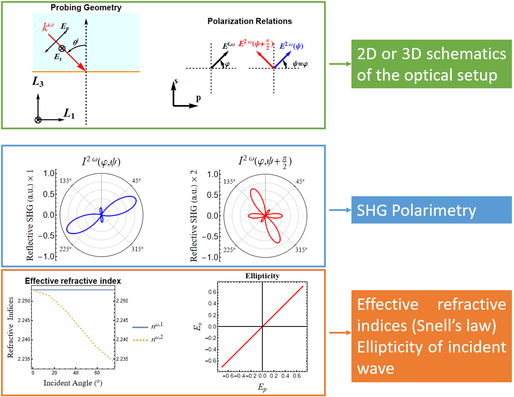

# Output Results
The content in the Output Panel depends on which mode is chosen in the Functionalities of the [Input Panels](input.md). 
## Numerical Simulation 
>
>**Output panel for Numerical Simulation**

This [panel](<input.md#Polarimetry Settings>) contains:
- the 2D/3D schematics of the optial setup (upper two figures). The upper left contains information of incident angles, lab coordinates and crystal physics coordinate. The upper right contains polarization settings of both polarizer (incident wave at $\omega$) and analyer (SHG wave at $2\omega$ )for generating the SHG polarimetry
- SHG polarplots as a function of $(\varphi,\psi)$ (middle two figures) as configured in upper right panel.
- the real part of refractive indices as a function of the incident angle (Snell's law) for the fundamental $\omega$ wave (lower left figure)
- the ellipticity figure of the incident wave(lower right figure)

## Partially Analytical Expression  
>
>**Output panel for Full Analytical Expression of GaAs (111)** 

This panel contains partial analytical expressions of output variables assuming symbolic SHG tensor and polarization angle $\varphi$.  
- The meaning of all the symbols are given in the [Table](table of symbols.md). 
- One can copy the analytical expression by click the Copy button on the left. 

## Fully Analytical Expression  
>
>
>**Output panel for Fully Analytical Expression of GaAs (111)**

- This panel contains fully analytical expressions of output variables without any numerical input.  
- The meaning of all the symbols are given in the [Table](table of symbols.md). 
- One can copy the analytical expression by click the Copy button on the left.
- The RHP will display the equations for reflected electric fields at $2\omega$ frequency ($E^{2\omega}(\varphi,\psi)$ and $E^{2\omega}(\varphi,\psi+pi/2)$) and provide the complete set of equations in a separate notebook file, **Full Analytical Expressions.nb**,in the same directory of ♯SHAARP._si_.
- The <b>Copy</b> button to the left of the expressions will allow you directly copy the expression and paste it into another document such as a Mathematica notebook, or Microsoft files.
!!! note
	In the RHP, you can still use <b>Copy</b> to copy equations though the equations are not displayed.